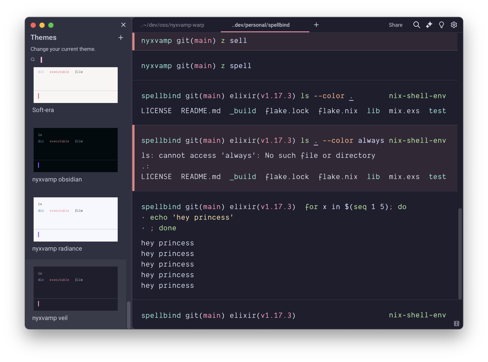
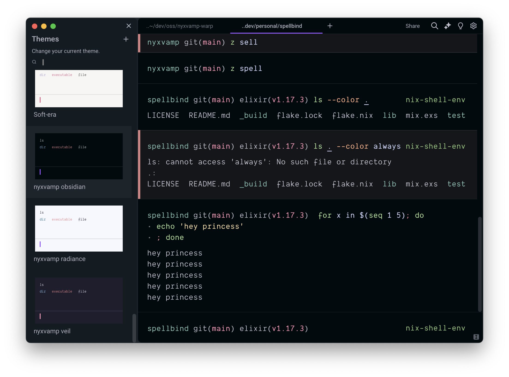
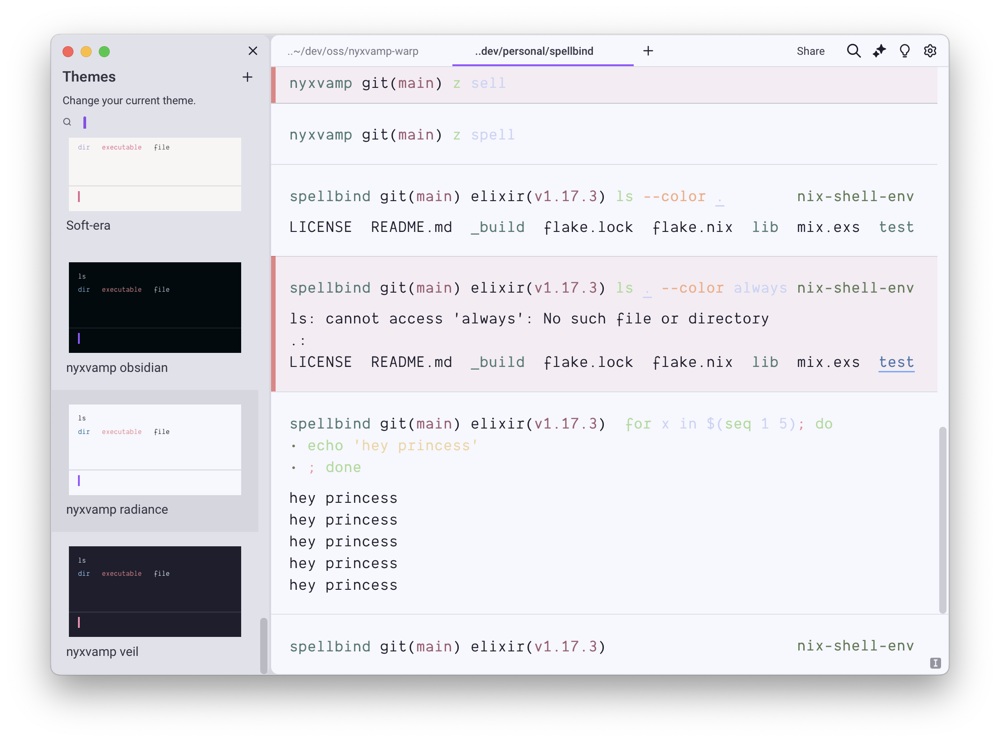

# nyxvamp (warp)

a minimalist theme collection, inspired by a blend of gothic and emo aesthetics with transfem symbolism. it combines deep purples and soft yellows with neutral tones to create strong contrasts and a comfortable coding environment that reflects individuality.

## variations

1. **veil**: versatile theme for both day and night, featuring bright accents on a dark background.

2. **obsidian**: dark theme for focused nighttime coding sessions.

3. **radiance**: light theme optimized for daylight use, ensuring excellent readability.

## usage

1. downloads files
 - `nyxvamp-veil.yml`
 - `nyxvamp-obsidian.yml`
 - `nyxvamp-radiance.yml`
2. place into the warp terminal themes directory
 - unix: `~/.warp/themes/`
3. issue the theme
 - open warp terminal
 - go to settings
 - into the theme picker chose NyxVamp and your favourite variant

## contribution

if you have suggestions or improvements, feel free to contribute or reach out.
